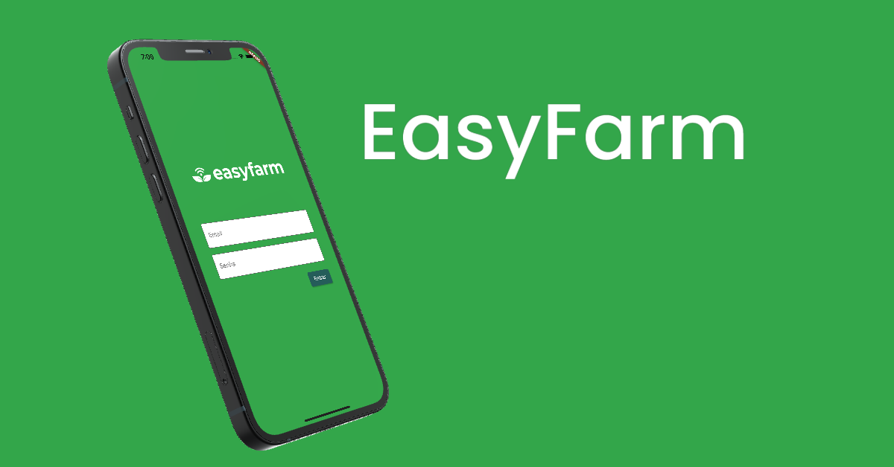

<h1 align="center">
    EasyFarm
</h1>

<p align="center">
  <a href="#-projeto">Projeto</a>&nbsp;&nbsp;&nbsp;|&nbsp;&nbsp;&nbsp;
  <a href="#rocket-tecnologias">Tecnologias</a>&nbsp;&nbsp;&nbsp;|&nbsp;&nbsp;&nbsp;
  <a href="#information_source-como-executar">Como executar</a>&nbsp;&nbsp;&nbsp;
  
</p>

<br>

<p align="center">
  
</p>

## 💻 Projeto

Projeto feito para seleção na empresa EasyFarm


## :rocket: Tecnologias

Esse app foi feito com as seguintes tecnologias:
- [Flutter][flutter]
- [Dart][dart]
- [Provider][provider]

## :information_source: Como executar

Para clonar e executar esse app você precisará do [Git](https://git-scm.com) + [Flutter][flutter] instalados no seu computador.

### Clone e execute 

```bash
# Clone esse repositório
$ git clone https://github.com/LeandroSimo/App_EasyFarm.git

# Entre no repositório
$ cd App_EasyFarm/

# Instale as dependências
$ flutter pub get

# Execute
$ flutter run

```

[flutter]: https://flutter.dev/
[dart]: https://dart.dev/
[provider]: https://pub.dev/packages/provider
